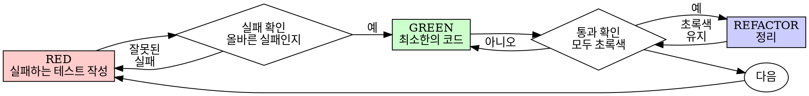

# 테스트 주도 개발 (TDD)

## 개요

테스트를 먼저 작성하세요. 실패하는 것을 확인하세요. 통과하는 최소한의 코드를 작성하세요.

**핵심 원칙:** 테스트가 실패하는 것을 보지 못했다면, 올바른 것을 테스트하는지 알 수 없습니다.

**규칙의 문자를 위반하는 것은 규칙의 정신을 위반하는 것입니다.**

## 사용 시기

**항상 사용:**
- 새로운 기능
- 버그 수정
- 리팩토링
- 동작 변경

**예외 (사용자에게 먼저 요청):**
- 일회용 프로토타입
- 생성된 코드
- 설정 파일

"이번 한 번은 TDD를 건너뛰자"라고 생각한다면 멈추세요. 그것은 합리화입니다.

## 철칙

```
실패하는 테스트 없이 프로덕션 코드를 작성하지 마십시오
```

테스트 전에 코드를 작성했나요? 삭제하고 처음부터 다시 시작하세요.

**예외 없음:**
- "참고용으로" 남겨두지 마세요
- 테스트를 작성하면서 "수정"하지 마세요
- 보지도 마세요
- 삭제는 진짜로 삭제하는 것입니다

테스트부터 처음부터 구현하세요. 끝.

## Red-Green-Refactor



### RED - 실패하는 테스트 작성

무슨 일이 일어나야 하는지 보여주는 최소한의 테스트를 하나 작성하세요.

```typescript
// 좋은 예
test('실패한 작업을 3회 재시도합니다', async () => {
  let attempts = 0;
  const operation = () => {
    attempts++;
    if (attempts < 3) throw new Error('fail');
    return 'success';
  };

  const result = await retryOperation(operation);

  expect(result).toBe('success');
  expect(attempts).toBe(3);
});
```
명확한 이름, 실제 동작 테스트, 한 가지만 테스트

```typescript
// 나쁜 예
test('retry works', async () => {
  const mock = jest.fn()
    .mockRejectedValueOnce(new Error())
    .mockRejectedValueOnce(new Error())
    .mockResolvedValueOnce('success');
  await retryOperation(mock);
  expect(mock).toHaveBeenCalledTimes(3);
});
```
모호한 이름, 코드가 아닌 모의 객체 테스트

**요구사항:**
- 하나의 동작
- 명확한 이름
- 실제 코드 (불가피한 경우가 아니면 모의 객체 사용 금지)

### RED 확인 - 실패하는 것 보기

**필수. 절대 건너뛰지 마세요.**

```bash
npm test path/to/test.test.ts
```
또는
```bash
npm run test:e2e path/to/test.e2e-spec.ts
```

확인:
- 테스트가 실패합니다 (에러가 아님)
- 실패 메시지가 예상한 것입니다
- 기능이 없어서 실패합니다 (오타가 아님)

**테스트가 통과하나요?** 기존 동작을 테스트하고 있습니다. 테스트를 수정하세요.

**테스트가 에러나나요?** 에러를 수정하고 올바르게 실패할 때까지 다시 실행하세요.

### GREEN - 최소한의 코드

테스트를 통과하는 가장 간단한 코드를 작성하세요.

```typescript
// 좋은 예
async function retryOperation<T>(fn: () => Promise<T>): Promise<T> {
  for (let i = 0; i < 3; i++) {
    try {
      return await fn();
    } catch (e) {
      if (i === 2) throw e;
    }
  }
  throw new Error('unreachable');
}
```
통과하기에 충분한 코드만

```typescript
// 나쁜 예
async function retryOperation<T>(
  fn: () => Promise<T>,
  options?: {
    maxRetries?: number;
    backoff?: 'linear' | 'exponential';
    onRetry?: (attempt: number) => void;
  }
): Promise<T> {
  // YAGNI (You Aren't Gonna Need It)
}
```
과도한 엔지니어링

테스트를 위한 기능 추가, 다른 코드 리팩토링, "개선"을 하지 마세요.

### GREEN 확인 - 통과하는 것 보기

**필수.**

```bash
npm test path/to/test.test.ts
```

확인:
- 테스트가 통과합니다
- 다른 테스트도 여전히 통과합니다
- 출력이 깨끗합니다 (에러, 경고 없음)

**테스트가 실패하나요?** 테스트가 아니라 코드를 수정하세요.

**다른 테스트가 실패하나요?** 지금 수정하세요.

### REFACTOR - 정리

초록색이 된 후에만:
- 중복 제거
- 이름 개선
- 헬퍼 추출

테스트를 초록색으로 유지하세요. 동작을 추가하지 마세요.

### 반복

다음 기능을 위한 다음 실패하는 테스트.

## 좋은 테스트

| 품질 | 좋음 | 나쁨 |
|---------|------|-----|
| **최소적** | 한 가지만. 이름에 "and"가 있나요? 분리하세요. | `test('validates email and domain and whitespace')` |
| **명확함** | 이름이 동작을 설명 | `test('test1')` |
| **의도 표현** | 원하는 API를 보여줌 | 코드가 무엇을 해야 할지 모호함 |

## 순서가 중요한 이유

**"나중에 테스트를 작성해서 동작하는지 확인하겠다"**

코드 뒤에 작성한 테스트는 즉시 통과합니다. 즉시 통과하는 것은 아무것도 증명하지 않습니다:
- 잘못된 것을 테스트할 수 있음
- 동작이 아니라 구현을 테스트할 수 있음
- 잊어버린 엣지 케이스를 놓칠 수 있음
- 버그를 잡는 것을 본 적이 없음

테스트 우선은 실패하는 것을 보게 하여 실제로 무언가를 테스트한다는 것을 증명합니다.

**"모든 엣지 케이스를 이미 수동으로 테스트했다"**

수동 테스트는 임시적입니다. 모든 것을 테스트했다고 생각하지만:
- 테스트한 것에 대한 기록이 없음
- 코드가 변경될 때 다시 실행할 수 없음
- 압박감 속에서 케이스를 잊기 쉬움
- "시도했을 때 작동했다" ≠ 포괄적

자동화된 테스트는 체계적입니다. 매번 같은 방식으로 실행됩니다.

**"X시간 작업을 삭제하는 것은 낭비다"**

매몰 비용 함정. 시간은 이미 갔습니다. 지금 선택:
- TDD로 다시 작성 (X시간 더, 높은 신뢰도)
- 유지하고 나중에 테스트 추가 (30분, 낮은 신뢰도, 버그 가능성)

"낭비"는 신뢰할 수 없는 코드를 유지하는 것입니다. 진짜 테스트 없이 작동하는 코드는 기술 부채입니다.

**"TDD는 교조적이다, 실용적이려면 적응해야 한다"**

TDD가 실용적입니다:
- 커밋 전 버그 찾기 (나중에 디버깅보다 빠름)
- 회귀 방지 (테스트가 즉시 파악)
- 동작 문서화 (테스트가 사용법 보여줌)
- 리팩토링 가능 (자유롭게 변경, 테스트가 파악)

"실용적" 지름길 = 프로덕션 디버깅 = 더 느림.

**"테스트 후도 같은 목표를 달성한다 - 정신이지 의식이 아니다"**

아닙니다. 테스트 후는 "이게 무엇을 하는가?"를 답합니다. 테스트 우선은 "무엇을 해야 하는가?"를 답합니다.

테스트 후는 구현에 의해 편향됩니다. 빌드한 것을 테스트하지, 요구사항을 테스트하지 않습니다. 기억한 엣지 케이스를 확인하지, 발견한 것을 확인하지 않습니다.

테스트 우선은 구현 전 엣지 케이스 발견을 강제합니다. 테스트 후는 모든 것을 기억했는지 확인합니다 (못했습니다).

테스트 후 30분 ≠ TDD. 커버리지는 얻지만 테스트가 작동한다는 증명은 잃습니다.

## 흔한 합리화

| 변명 | 현실 |
|--------|---------|
| "너무 단순해서 테스트 안 해도 됨" | 단순한 코드도 깨짐. 테스트는 30초. |
| "나중에 테스트할게" | 즉시 통과하는 테스트는 아무것도 증명 안 함. |
| "테스트 후도 같은 목표" | 테스트 후 = "이게 뭐하는 거지?" 테스트 우선 = "뭘 해야 하는 거지?" |
| "이미 수동으로 테스트함" | 임시적 ≠ 체계적. 기록 없음, 재실행 불가. |
| "X시간 작업 삭제는 낭비" | 매몰 비용 함정. 검증 안 된 코드 유지가 기술 부채. |
| "참고용 남겨두고 테스트 먼저" | 수정하게 됨. 그건 테스트 후임. 삭제는 진짜 삭제. |
| "먼저 탐색해야 함" | 좋음. 탐색은 버리고 TDD로 시작. |
| "테스트하기 어려움 = 설계 불명확" | 테스트를 들으세요. 테스트하기 어렵다 = 사용하기 어렵다. |
| "TDD가 느려질 것" | TDD가 디버깅보다 빠름. 실용적 = 테스트 우선. |
| "수동 테스트가 더 빠름" | 수동은 엣지 케이스를 증명 안 함. 변경마다 재테스트. |

## 적신호 - 멈추고 처음부터 다시 시작

- 테스트 전 코드
- 구현 후 테스트
- 테스트가 즉시 통과
- 왜 테스트가 실패했는지 설명 못 함
- "나중에" 테스트 추가
- "이번 한 번만" 합리화
- "이미 수동으로 테스트함"
- "테스트 후도 같은 목적"
- "정신이지 의식이 아니다"
- "참고용 유지" 또는 "기존 코드 수정"
- "이미 X시간 썼는데 삭제는 낭비"
- "TDD는 교조적, 나는 실용적"
- "이건 다르니까..."

**이 모든 것은: 코드를 삭제하세요. TDD로 처음부터 다시 시작하세요.**

## 예시: 버그 수정

**버그:** 빈 이메일 허용됨

**RED**
```typescript
test('빈 이메일을 거부합니다', async () => {
  const result = await submitForm({ email: '' });
  expect(result.error).toBe('Email required');
});
```

**RED 확인**
```bash
$ npm test
FAIL: expected 'Email required', got undefined
```

**GREEN**
```typescript
function submitForm(data: FormData) {
  if (!data.email?.trim()) {
    return { error: 'Email required' };
  }
  // ...
}
```

**GREEN 확인**
```bash
$ npm test
PASS
```

**REFACTOR**
필요한 경우 여러 필드의 검증을 추출.

## 검증 체크리스트

작업 완료 표시 전:

- [ ] 모든 새 함수/메서드에 테스트가 있음
- [ ] 각 테스트가 실패하는 것을 보고 구현
- [ ] 각 테스트가 예상된 이유로 실패 (기능 없음, 오타 아님)
- [ ] 통과하기 위한 최소한의 코드 작성
- [ ] 모든 테스트 통과
- [ ] 출력이 깨끗함 (에러, 경고 없음)
- [ ] 실제 코드 사용 (불가피한 경우가 아니면 모의 객체 금지)
- [ ] 엣지 케이스와 에러 처리됨

모든 체크박스를 체크할 수 없나요? TDD를 건너뛴 것입니다. 처음부터 다시 시작하세요.

## 막힐 때

| 문제 | 해결책 |
|---------|----------|
| 테스트 방법을 모르겠음 | 원하는 API를 작성. assertion부터. 사용자에게 요청. |
| 테스트가 너무 복잡함 | 설계가 너무 복잡함. 인터페이스 단순화. |
| 모든 것을 모의해야 함 | 코드가 너무 결합됨. 의존성 주입 사용. |
| 테스트 설정이 너무 큼 | 헬퍼 추출. 여전히 복잡? 설계 단순화. |

## 디버깅 통합

버그 발견? 재현하는 실패하는 테스트를 작성하세요. TDD 사이클을 따르세요. 테스트가 수정을 증명하고 회귀를 방지합니다.

테스트 없이 버그를 수정하지 마세요.

## 최종 규칙

```
프로덕션 코드 → 테스트가 존재하고 먼저 실패함
그렇지 않음 → TDD가 아님
```

사용자의 허가 없이 예외 없음.
